# MeshPoint CYD: User Manual

MeshPoint CYD turns a Freenove 3.5" ESP32-S3 touchscreen (FNK0104N) into a desk-side display
for a [Meshpoint](https://github.com/KMX415/meshpoint) node, the Raspberry Pi based Meshtastic
base station. It connects to your Meshpoint over WiFi and shows, at a glance and without a
browser:

- how busy the mesh is (packets, packet rate, active nodes, signal levels)
- every node your Meshpoint has heard, with signal, battery, and hop count
- a live map of nodes and the links between them, coloured by how recently each was heard
- the live packet feed
- channel and direct-message conversations
- the health of the Meshpoint's Raspberry Pi (CPU, temperature, memory, disk)

It also plays distinct alert chimes for new channel messages, new direct messages, and newly
discovered nodes, and it tells you when a Meshpoint software update is available and can install
it for you.

Apart from installing Meshpoint updates (which you have to confirm), the display only reads from
the Meshpoint. It can't send messages or change the Meshpoint's configuration.

---

## Contents

1. [What you need](#what-you-need)
2. [First-time setup](#first-time-setup)
3. [Finding your way around](#finding-your-way-around)
4. [Home tab](#home-tab)
5. [Nodes tab](#nodes-tab)
6. [Map tab](#map-tab)
7. [Feed tab](#feed-tab)
8. [Chat tab](#chat-tab)
9. [Settings tab](#settings-tab)
10. [Alert sounds](#alert-sounds)
11. [Auto-dim](#auto-dim)
12. [Updating the Meshpoint](#updating-the-meshpoint)
13. [USB serial commands](#usb-serial-commands)
14. [Troubleshooting](#troubleshooting)
15. [For developers](#for-developers)

---

## What you need

- **Freenove FNK0104N**: the ESP32-S3 display board with the 3.5" 320x480 touchscreen and
  speaker (Freenove's "ESP32-S3 Display, 3.5 inch").
- **A running Meshpoint** on the same network, and its dashboard address, for example
  `http://192.168.86.106:8080`.
- **A Meshpoint dashboard login.** The display works with either account:
  - `viewer` (recommended): read-only, which is all the display needs. Set a viewer password in
    the Meshpoint dashboard's settings.
  - `admin`: also works, and is required if you want to install Meshpoint updates from the
    display.
- **A 2.4 GHz WiFi network.** The ESP32 does not support 5 GHz.
- **A USB-C cable and a computer with [PlatformIO](https://platformio.org/)**, only needed to
  install or update the software.

---

## First-time setup

### 1. Install the software

Get the code:

    git clone https://github.com/parheliatech/MeshPointCYD.git
    cd MeshPointCYD

Optionally, back up the board's original firmware first so you can restore it later
(`esptool.py` comes with PlatformIO):

    mkdir -p backup
    esptool.py --port /dev/ttyACM0 read_flash 0 0x1000000 backup/factory_flash_16MB.bin

The backup can contain the WiFi password saved on the board, so keep it private. The
`backup/` folder is already listed in `.gitignore`.

Then connect the board by USB and run:

    pio run -t upload

### 2. Connect it to WiFi and your Meshpoint

On first boot, or whenever it has no saved WiFi, the display shows **WiFi setup** and starts
its own setup hotspot:

1. On your phone, join the WiFi network **`MeshPointCYD-Setup`**.
2. A setup page should open automatically. If it doesn't, browse to **http://192.168.4.1**.
3. Choose your WiFi network and enter its password.
4. Fill in the Meshpoint fields:
   - **Meshpoint URL**: e.g. `http://192.168.86.106:8080` (the same address you use in a browser)
   - **Username**: `viewer` or `admin`
   - **Password**: that account's dashboard password
   - **Time zone** (optional, defaults to UTC): a POSIX time zone string. It's easier to leave
     this and pick your zone later from a list in **Settings → Time zone**. Examples:

     | Location | Enter |
     |---|---|
     | Arizona (no daylight saving) | `MST7` |
     | US Pacific | `PST8PDT,M3.2.0,M11.1.0` |
     | US Mountain | `MST7MDT,M3.2.0,M11.1.0` |
     | US Central | `CST6CDT,M3.2.0,M11.1.0` |
     | US Eastern | `EST5EDT,M3.2.0,M11.1.0` |
     | UTC | `UTC0` |
5. Save. The display joins your WiFi and the dashboard appears within a few seconds.

All settings are saved on the board and survive power cycles and software updates.

To change them later, use **Settings → WiFi / Meshpoint setup portal**, hold a finger on the
screen while the board powers up, or use the [USB serial commands](#usb-serial-commands).

---

## Finding your way around

Every screen has the same frame:

**Header (top bar)**

- **Status light** (left):
  - 🟢 green: connected and data is fresh
  - 🟠 amber: connecting, or no successful update in the last minute
  - 🔴 red: WiFi down, login failed, or the Meshpoint can't be reached (the Settings tab shows why)
- **Meshpoint name**, as configured on your Meshpoint.
- **WiFi signal bars** and the **clock** (right).

**Tab bar (bottom):** **Home · Nodes · Map · Feed · Chat · ⚙ Settings**. The Chat tab shows a
badge with the number of unread messages. The Settings gear turns **amber with a dot** when a
Meshpoint software update is available.

**Touch gestures**

| Gesture | Effect |
|---|---|
| Tap a tab | Switch pages |
| Tap the tab you're already on | Close a detail view, or jump back to the top |
| Drag up or down | Scroll lists and long pages |
| Drag on the map | Pan the map |
| Tap a row | Open details (nodes, conversations) |
| **Back** button | Leave a detail view |

A thin scrollbar at the right edge shows when a page has more content below.

---

## Home tab

The dashboard: a summary of your Meshpoint and its mesh.

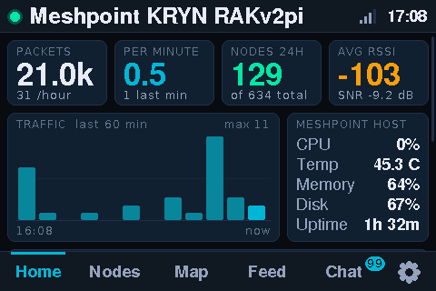

- **Packets**: total packets stored on the Meshpoint, and how many arrived in the last hour.
- **Per minute**: average packet rate over the last hour, plus the count from the last minute.
- **Nodes 24h**: nodes heard in the last 24 hours, out of all nodes ever heard.
- **Avg RSSI**: average received signal strength (dBm) and signal-to-noise ratio (dB) over
  recent packets. Colours: green is good (above -95 dBm), amber is fair (-95 to -110), red is
  weak (below -110).
- **Traffic, last 60 min**: packets per 5-minute block. The brightest bar is the current block.
- **Meshpoint host**: the Raspberry Pi's CPU load, temperature, memory, disk use, and uptime.
  Values turn amber or red when they run high.

Scroll down for more:

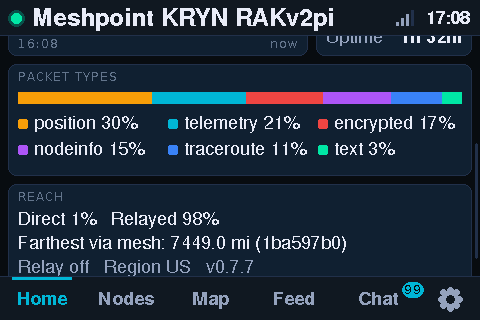

- **Packet types**: the mix of traffic (position, telemetry, node info, text, encrypted, ...),
  using the same colours as the Meshpoint dashboard.
- **Reach**: the share of packets heard directly versus relayed by other nodes, the farthest
  node reached through the mesh, relay status, radio region, and Meshpoint version.

---

## Nodes tab

Every node the Meshpoint has heard, most recent first (up to 80).

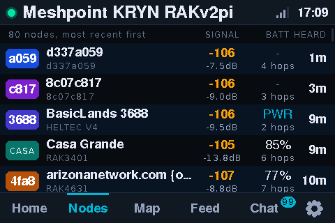

Each row shows:

- **Badge**: the node's short name. Nodes without one show the last four characters of their ID.
- **Name**, with **hardware model** and **role** underneath.
- **Signal**: RSSI of the last packet (colour-coded) and SNR below it.
- **Batt**: battery percentage (PWR = on external power), and **hops**: how many relays the last
  packet passed through ("direct" = heard firsthand).
- **Heard**: time since the node was last heard.

**Tap a node** for its full details: ID, protocol, hardware, role, first and last heard, packet
count, signal, hops, battery and voltage, environment sensors (temperature, humidity), channel
utilisation, firmware, and position when available.

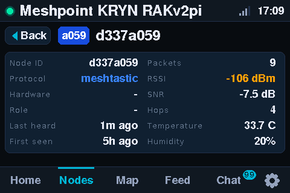

---

## Map tab

A map of every node with a known position, and the radio links between them. It uses a plain
dark background with no street map, so it works fully offline.

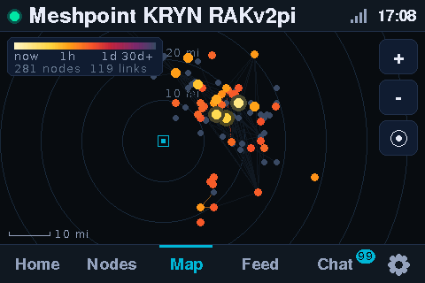

**Reading the map**

- **Dots are nodes, coloured by "heat"**: how recently each was heard. The legend at top left runs
  from **white-yellow (just now)** through orange (about an hour), red (about a day), and plum,
  to **grey (30 days or more)**. Nodes heard in the last hour are drawn larger, and those heard
  in the last 15 minutes glow.
- **Lines are links** between nodes that the Meshpoint has observed, coloured the same way. Links
  older than a week fade almost into the background.
- The **cyan square** is your Meshpoint's configured location. **Rings** around it mark distance
  in miles, and the **scale bar** is at bottom left.
- A **purple outline** marks MeshCore nodes.
- A **pulsing cyan ring** marks a node that has just appeared. It pulses for 2 minutes.
- The legend also shows how many nodes and links are on the map. Links can only be drawn when
  both ends have a known position.
- Node names appear once you zoom in far enough for them to fit.

**Moving around**

| Control | Effect |
|---|---|
| Drag | Pan |
| **+** / **-** | Zoom in / out (around the selected node, if one is selected) |
| Double-tap an empty spot | Zoom in on that spot |
| **Target** button | Re-fit the view to your local mesh |

The initial view frames your Meshpoint together with the nearest 85% of nodes heard in the last
week, so a few distant or bogus positions don't shrink everything to a dot.

**Tap a node** to select it. Its links are highlighted, and a card shows its name, when it was last
heard, its signal, its distance from your Meshpoint, and how many links it has. Tap empty map to
clear the selection.

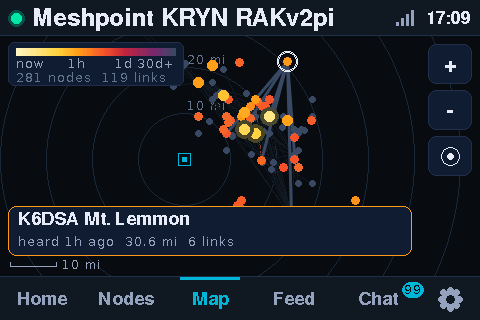

**Updates:** the map refreshes every 20 seconds while it's on screen, and every 5 minutes
otherwise. If the Meshpoint's total node count changes (a node discovered or removed), the map
refreshes within about 15 seconds, whichever tab you're on.

---

## Feed tab

The most recent packets captured by the Meshpoint (up to 40), refreshed every 4 seconds while
you're watching.

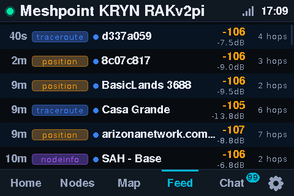

Each row shows the packet's **age**, its **type** (colour-coded like the Meshpoint dashboard),
the **sender** (the dot shows protocol: blue for Meshtastic, purple for MeshCore), **RSSI and SNR**,
and **hops**. Text messages show their text under the sender.

---

## Chat tab

Conversations the Meshpoint has seen: channels (**#**) and direct messages (**@**), most recent
first, with an unread count badge.

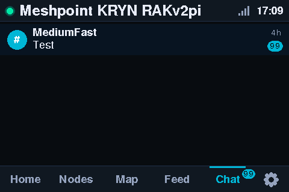

**Tap a conversation** to read it. Your own messages appear on the right. Received messages show
the sender, age, and signal strength. The view keeps itself scrolled to the newest message and
updates every 10 seconds.

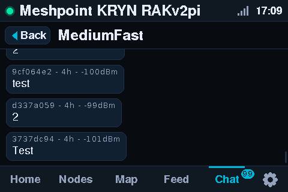

Unread counts come from the Meshpoint. They clear when messages are read in the Meshpoint's web
dashboard, not on this display.

---

## Settings tab

Tap the **gear** icon.

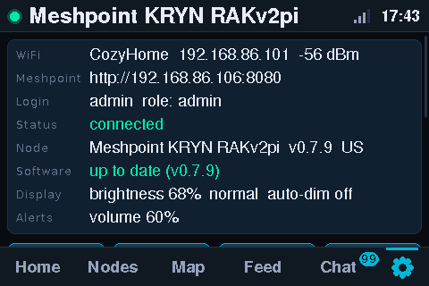

The top card shows the current state: WiFi network, IP address and signal, the Meshpoint
address, the login in use, the **connection status** (with the error message when something is
wrong), the Meshpoint's name, version and region, whether the Meshpoint software is up to date,
display settings, and alert volume. When an update is available, a banner at the top offers to
install it (see [Updating the Meshpoint](#updating-the-meshpoint)).

Scroll down for the controls:

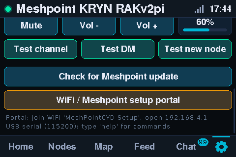

| Control | What it does |
|---|---|
| **Flip** | Rotates the picture 180° (touch follows), for mounting the board the other way up |
| **Dimmer / Brighter** | Adjusts screen brightness |
| **Refresh** | Logs in again and reloads everything now |
| **Auto-dim after 5 min** | Turns [auto-dim](#auto-dim) on or off (default off) |
| **Time zone** | Opens a list of common time zones; tap one to use it. The clock starts on UTC until you choose. Zones not in the list can be set in the setup portal or with the `tz` serial command, and show as "Custom". |
| **Mute / Unmute** | Silences all alert sounds |
| **Vol - / Vol +** | Alert volume in 10% steps, with a short chime so you hear the new level |
| **Test channel / Test DM / Test new node** | Plays each alert sound, even when muted |
| **Check for Meshpoint update** | Asks the Meshpoint to check GitHub for a newer release now |
| **WiFi / Meshpoint setup portal** | Restarts into the setup hotspot to change WiFi, Meshpoint address, login, or time zone |

All settings are saved immediately.

---

## Alert sounds

The speaker plays a different sound for each kind of event:

| Event | Sound |
|---|---|
| New **channel** message | Soft two-note chime |
| New **direct** (private) message | Quicker, brighter four-note rising arpeggio |
| **New node** discovered | Two sonar-style rising sweeps |

- Message alerts fire when a conversation's unread count goes up. The Meshpoint is checked every
  15 seconds, or every 8 seconds while you're on the Chat tab.
- The new-node alert fires when the Meshpoint's total node count goes up. It's checked every
  15 seconds.
- If several events arrive together, each kind of sound plays once.
- Volume and mute are on the Settings tab. The default volume is 60%.

---

## Auto-dim

When **Auto-dim after 5 min** is ON (Settings tab), the screen drops to 10% brightness after five
minutes without a touch. If your brightness setting is already lower, it stays at your setting.

Touch anywhere to wake it. That first touch only wakes the screen; it doesn't press buttons or
switch tabs.

Auto-dim is **off** by default.

---

## Updating the Meshpoint

About every 30 minutes the display asks your Meshpoint whether a newer Meshpoint release is
available on GitHub. You can also check right away with **Settings → Check for Meshpoint update**.

When an update is available:

1. The **Settings gear turns amber** (with a small dot).
2. Open **Settings**. A banner at the top shows the installed and new versions, for example
   `v0.7.7 -> v0.7.9`, and the release channel (normally `stable`).

   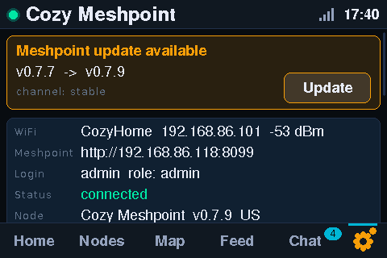

3. Tap **Update**, then **Install** to confirm, or **Cancel**. The confirmation goes away by itself
   after 15 seconds.
4. The banner shows each step as the Meshpoint runs it: `git fetch`, `git checkout`, `git reset`,
   then `upgrade`, which installs dependencies and restarts the Meshpoint service. This is the
   same update the Meshpoint's own web dashboard performs.

   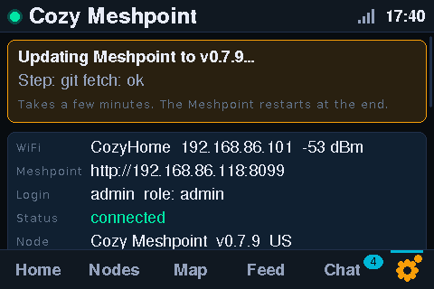

5. When it finishes, the banner turns green: **Update installed. Meshpoint is restarting.** While
   the Meshpoint restarts, the status light goes amber or red for a few minutes. The display
   reconnects by itself, and the banner and amber gear clear once the Meshpoint reports the new
   version.

If a step fails, a red banner names the failed step. Tap **Dismiss**, then check the Meshpoint's
web dashboard or log for details.

Installing requires the display to be logged in as **admin**. With a `viewer` login the banner
still tells you about the update, but you'll need to install it from the Meshpoint dashboard or
log the display in as admin.

---

## USB serial commands

With the board connected by USB, open a serial terminal at **115200 baud**, for example
`pio device monitor`, and type a command followed by Enter:

| Command | Effect |
|---|---|
| `help` | List commands |
| `show` | Print current settings and WiFi status |
| `url http://host:8080` | Set the Meshpoint address |
| `user viewer` / `user admin` | Set the login username |
| `pass <password>` | Set the login password |
| `tz <POSIX TZ>` | Set the time zone (e.g. `MST7`) |
| `wifi <ssid> [password]` | Join a WiFi network (SSID without spaces) |
| `flip 0` / `flip 1` | Normal / upside-down display |
| `volume <0-100>` | Alert volume |
| `mute 0` / `mute 1` | Unmute / mute alerts |
| `beep channel` / `beep dm` / `beep node` | Play an alert sound |
| `autodim 0` / `autodim 1` | Auto-dim off / on |
| `status` | Idle timer, dim state, touch state |
| `portal` | Restart into the WiFi setup portal |
| `reboot` | Restart the display |

Settings changed this way take effect immediately and are saved.

---

## Troubleshooting

| Symptom | What to check |
|---|---|
| Red status light, "WiFi not connected" | The network must be 2.4 GHz. Re-enter WiFi details with the setup portal. |
| "Meshpoint login failed" | Check the username (`viewer` or `admin`) and password. Log in with the same details in a browser to confirm. The Meshpoint locks an account for 5 minutes after 5 wrong passwords. |
| "Can't reach Meshpoint" | Check the Meshpoint URL, including `http://` and `:8080`, and that the Meshpoint is running. If its IP address changed, update the URL. |
| Amber light | The last update is more than a minute old. It usually recovers by itself; tap **Refresh** to retry now. |
| Picture is upside down | **Settings → Flip**. |
| Clock is wrong | The clock starts on UTC. Pick your zone in **Settings → Time zone**. The clock also needs internet access for time sync. |
| No sound | Check **Mute** and the volume in Settings, and try the **Test** buttons. |
| Map is empty | Only nodes that report a GPS position appear. Nodes at 0,0 are hidden. |
| Screen stays dark | It may be auto-dimmed. Touch it. Otherwise press **Brighter** or check `show` over USB. |
| Update banner says the update failed | Tap **Dismiss** and check the Meshpoint's web dashboard (Settings → Updates) or log for the failed step. |
| Gear stays amber after updating | The display re-checks every minute for 15 minutes after an update. Use **Check for Meshpoint update** to check again. |
| Screen stays blank after a software update | The update was probably interrupted. Run `pio run -t upload` again. |

To restore the board's original Freenove demo firmware, flash the backup you took before
installing this software (see [First-time setup](#first-time-setup)):

    esptool.py --port /dev/ttyACM0 write_flash 0 backup/factory_flash_16MB.bin

---

## For developers

### Hardware notes (FNK0104N)

| Part | Details |
|---|---|
| MCU | ESP32-S3, 16 MB flash, 8 MB **octal** PSRAM (`memory_type = qio_opi`) |
| Display | ST77922, 320x480, QSPI on SPI2 (CS 10, SCLK 12, D0-D3 11/13/14/9), backlight PWM on GPIO 41 |
| Touch | ST77922 TDDI controller, I2C 0x55 (SDA 38, SCL 39, RST 48, INT 47). Each report must be read in full (all point slots) or the controller stops reporting. |
| Audio | ES8311 codec at I2C 0x18, I2S (MCLK 17, BCLK 18, WS 21, DOUT 15), amplifier enable GPIO 1 (active low) |

### Source layout

| File | Purpose |
|---|---|
| `src/main.cpp` | Boot, WiFi/portal, serial console, touch loop, auto-dim |
| `src/panel.*` | Display driver (full-frame push with rotation) and touch driver |
| `src/ui.*` | All pages, rendering (LovyanGFX sprite in PSRAM), gestures |
| `src/meshpoint.*` | Background polling task, Meshpoint REST client, data model |
| `src/audio.*` | ES8311 setup and alert-tone synthesis |
| `src/config.*` | Saved settings (NVS), setup portal, serial commands |
| `src/hw_names.h` | Meshtastic hardware model names (from Meshpoint's frontend) |

### Meshpoint API used

The display logs in with `POST /api/auth/login` and sends the session back as the
`meshpoint_session` cookie, which works with older Meshpoints that don't return a token in the
response body. It then polls:

| Endpoint | Used for | Interval (tab visible / otherwise) |
|---|---|---|
| `/api/stats/summary` | Home | 10 s / 30 s |
| `/api/device/metrics` | Home (host) | 15 s / 60 s |
| `/api/nodes?limit=80` | Nodes, names in Feed | 15 s / 60 s |
| `/api/nodes/map`, `/api/analytics/topology` | Map | 20 s / 5 min |
| `/api/packets?limit=40` | Feed | 4 s / 30 s |
| `/api/messages/conversations`, `/channels` | Chat, message alerts | 8 s / 15 s |
| `/api/messages/conversation/{id}` | Open conversation | 10 s |
| `/api/nodes/count` | New-node alert, map refresh | 15 s |
| `/api/device` | Meshpoint location | 10 min |
| `/api/device/update-check`, `/api/update/install_status` | Update availability and release channel | 30 min |
| `POST /api/update/apply/stream` | Install an update (admin), with NDJSON progress | on demand |

### Tools

- `tools/mock_meshpoint.py [port] [--old] [--any-password] [--update] [--update-fail]`: a fake
  Meshpoint API (password `test`) for working without a real node. `--old` mimics cookie-only
  login, `--update` / `--update-fail` simulate an available update that installs or fails.
- `tools/screenshot.py out.png [--cmd "tap 210 298"]...`: saves the screen over USB serial as a
  PNG. The manual's screenshots were made with it.
- Extra serial commands for testing: `screenshot`, `tap x y`, `swipe x y1 y2`,
  `drag x1 y1 x2 y2`, `touchlog`, `touchraw`, `touchdiag`. Tab centres are at y = 298 and
  x = 42 (Home), 126 (Nodes), 210 (Map), 294 (Feed), 378 (Chat), 450 (Settings).

---

## License

MeshPoint CYD is free software under the [GNU Affero General Public License v3.0](LICENSE),
the same license as Meshpoint. Parts are adapted from Freenove's FNK0104 example code
(CC BY-NC-SA 3.0), Espressif's ES8311 driver, and Meshpoint itself. See [NOTICE](NOTICE) for
details and attribution.

This project is not affiliated with Meshpoint, Freenove, or Meshtastic.
